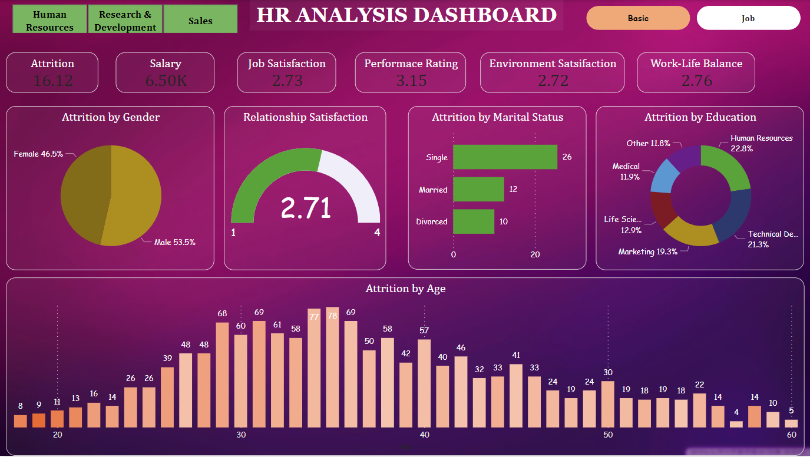
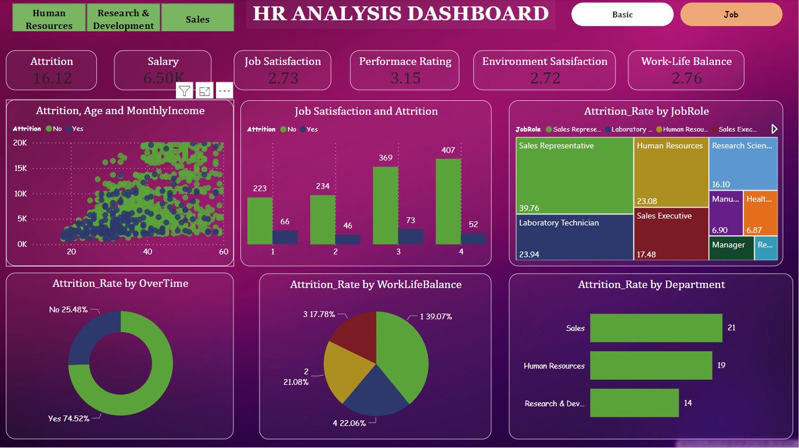

# HR_Analysis

## Introduction

This project aims to analyze employee attrition data to identify patterns and factors that contribute to employee turnover. The analysis is performed using the dataset [`HR_Employee_Attrition.csv`](./data/HR_Employee_Attrition.csv) and visualized in the Power BI report [`HR_Analysis.pbix`](./HR_Analysis.pbix). The Jupyter notebook [`HR.ipynb`](./HR.ipynb) contains the data preprocessing and analysis steps.

## Dashboard
The Power BI report contains the following visualizations:

